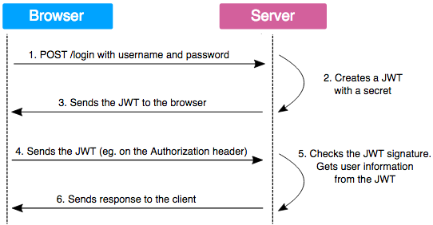

# DigitalAgriHub DataEntry
Digital Agri Hub offers a data entry facility for digital solution and service providers. As a solution provider, it offers you the opportunity to register your digital solutions for agriculture deployed in low- and middle-income countries or to update existing data in our database. This will feature your digital solutions in the Digital Agri Hub dashboard with the most up-to-date information, also making them more visible to investors, donors, and other stakeholders in the D4Ag sector. More information can be found in https://digitalagrihub.org/web/guest/submit-your-data.

## 1. Description

A two-module Spring project with user management to enter and modify data based on JSON Web Tokens (JWT) in Digital Agri Hub project.

JWT are tokens generated by the server upon user authentication on a web application, and then sent to the client.

These tokens are then sent on every HTTP request, which allows the server to authenticate the user.

To ensure integrity, information contained in the token is signed by a private key, owned by the server. When the server gets the token back from the client, it just has to compare the signature sent by the client with the one it will generate with its private key. If the signatures are identical, the token is then valid.

## 2. Modules

### 2.1. Backend
The backend is implemented in **Java** by using **Spring framework**.  
The followings are used as dependency:
- spring-boot-starter-data-rest
- spring-boot-starter-security
- spring-boot-starter-web
- spring-boot-starter-websocket
- lombok
- spring-messaging
- spring-security-messaging
- spring-security-data
- jjwt-api
- jjwt-impl
- jjwt-jackson
- passay
- guava
- gson
- springdoc-openapi-ui
- springdoc-openapi-data-rest
- springdoc-openapi-security
- spring-boot-starter-mail
- commons-validator

The folder _src/_ contains the backend related source code.

### 2.2. Frontend
The frontend is implemented in Javascript by using **React**.  
The followings are used as dependency:
- @mui/icons-material
- @mui/material
- @mui/styled-engine-sc
- @tinymce/tinymce-react
- react
- react-dom
- react-google-recaptcha-v3
- react-number-format
- react-router-dom
- react-scripts
- styled-components
- web-vitals

The folder _frontend/_ contains the frontend related source code.

## 3. Compile & run

In the **project** directory:
- `mvn clean package [-DskipTests]`
- `java -jar target/dataentry-0.0.1.jar`

or 

- `docker build -t dataentry .`
- `docker run --rm -p 8080:8080 dataentry`

Then on the browser:
- `http://localhost:8080/dataentry`

## 4. Technologies
- Spring Boot & Framework
- Spring Data JPA
- Spring Security
- JSON Web Token
- WebSocket 
- PostgreSQL
- Lombok
- OpenAPI
- Java 17
- Maven: spring-boot-maven-plugin
- JavaScript
- React
- Docker

## 5. Endpoints

### 5.1. Application endpoints
The backend endpoints start with `/dataentry/api`.  
All POST requests should include CSRF token in the header.  
The login request requires *Basic authentication* in the header of the request.  
All other requests require *Bearer authentication* in the header of the request.

### 5.2. WebSocket endpoints
- localhost:8080/dataentry/**websocket**
- Subscriptions: **/topic**  
The subscriptions to following endpoints result in sending the path of corresponding *solution* or *organisation* in case of any change (i.e., insertion, update, deletion).  
  - /topic/newSolution
  - /topic/updateSolution
  - /topic/deleteSolution
  - /topic/newOrganisation
  - /topic/updateOrganisation
  - /topic/deleteOrganisation

### 5.3. OPENAPI endpoints
- http://localhost:8080/dataentry/api/swagger-ui/index.html
- http://localhost:8080/dataentry/api/docs

## 6. Backend tests

Tests might need to be updated.

- Authorization error tests
  - CSRF errors
  - Basic authentication errors (i.e. login)
  - Bearer authentication errors (i.e. JWT)
- Register validation tests
  - Invalid email
  - Invalid password
  - Unmatched passwords
  - Null value
  - Empty string
- Repository authorization tests
  - Finding solutions for owner
  - Finding solutions for another user
  - Finding solutions for admin
- Request header tests
  - CSRF
  - Content type 
  - Basic authentication
  - Bearer authentication
- REST tests
  - Get OK
  - Get without authentication
  - Post METHOD_NOT_ALLOWED
  - Delete METHOD_NOT_ALLOWED
  - Delete without authentication
  - Post & Delete 
  - Post, Put & Delete
- User tests
  - Successive registration
  - Successive login (i.e. invalid token)
  - Logout
- WebSocket tests
  - /topic/newSolution  
  - /topic/updateSolution  
  - /topic/deleteSolution  

